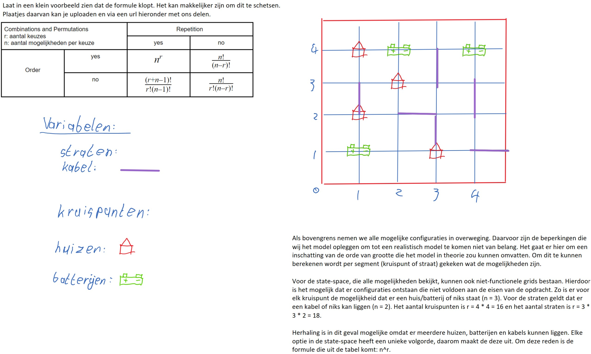

# DuraNett
# Project of Programming Minor - SmartGrid

The transition to sustainable energy sources is one of the great challenges of modern times. Fossil fuels will have to be exchanged for sustainable alternatives. Solar energy is one of these alternatives. Our power grid, however, is not yet capable of storing all this energy. This project is an attempt to create a theoretical model of the most efficient grid possible, to maybe help towards a solution in this bigger problem. 

## Case
Within the case there are three neighborhoods with five batteries each and one hundred fifty houses. The goal is to minimize costs, given some validity requirements. 

The costs in our case are: 
- Battery-cost (5000 p/battery)
- Cable-costs (9 p/cable segment)

The validity requirements are:
- All houses are connected to a house
- None of the capacities of batteries is exceeded

## Getting started

### Requirements

This codebase is written in Python 3.9+. For our visualisation we used the matplotlib package. This package is available for installation through the following commandline input:

> pip3 install matplotlib

### Usage

To run our code the following usage key is used:

> python3 SmartGrid.py \<district number\> \<constructive algorithm\> optional: \<iterable algoritm\>

### Structure

The following list describes the way our codebase is structured:

- /code
    - /code/algorithms: contains the code of our four algorithms
    - /code/classen: contains the code of our 
    - /code/future_work
    - /code/scripts
    - /code/visualisation
    - output.json
    - results.png
    - SmartGrid.py
- /data
- /images
- README.md

## Algorithms

### Random

The ranadom algorithm takes list of housen and batteries. Afterwards, it takes a random battery and a random houses and fills all batteries in this manner. Before placing the house, a check is done which looks at the batteries that are available for the placement of a house. If all batteries are full it takes a random battery, pops a house, and places the new house in the battery. The popped house is added to the list of houses to be placed. If the house does not fit in the battery, the mover is reversed, and the popped house is place back into the battery. In this case, the house that was to be placed, stays in the houses list, and another attempt is made to switch houses. This process is repeated until all houses are placed and no battery is overloaded. 

### Depth-first 

The depth-first search algorihm takes the batteries and houses. Afterwards, it places the houses in the batteries in such a way that the batteries are not overload, and returns the first solution that it finds. In practise the search will always go through the tree all the way to the bottom left, where it will find the first solution, as all houses are placed. 
 
### Hill Climber 

### Simulated Annealing

## Authors

- Joey Bink
- Jasper Claessen
- Camiel de Kom

State Space